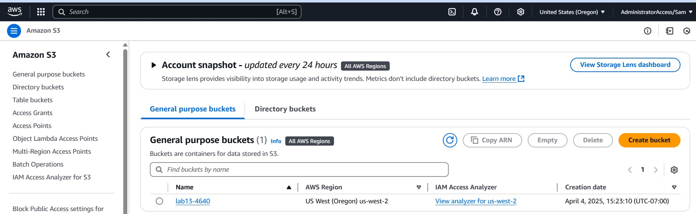
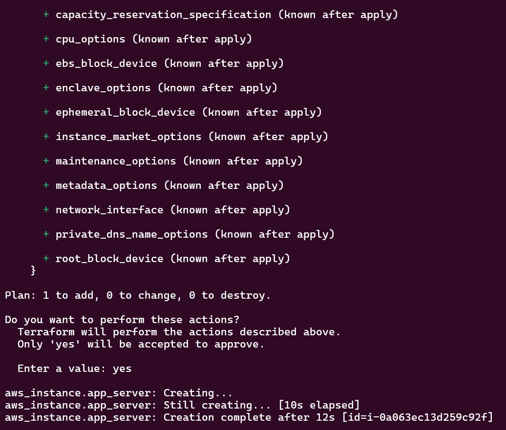
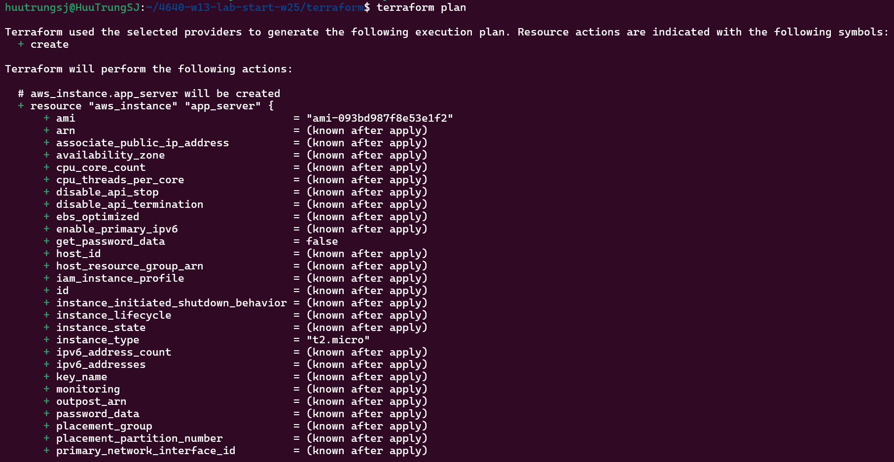
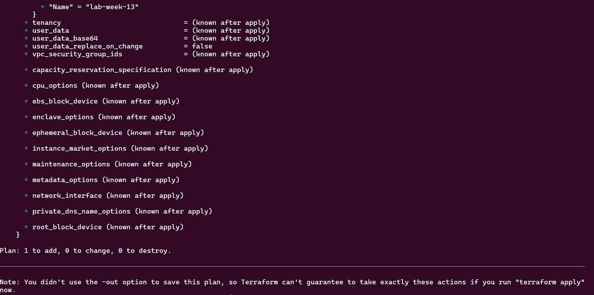

# 4640-w13-lab-start-w25

* When is the state file created?
The state file is created during the terraform init or terraform apply process. It is used to track the resources managed by Terraform.
* When is the lock file present?
The lock file is created temporarily during terraform plan or terraform apply to prevent concurrent operations on the state file.
* Is the lock file always in the bucket after it is created?
No, the lock file is temporary and is removed after the operation completes.

## State File

## Lock File

